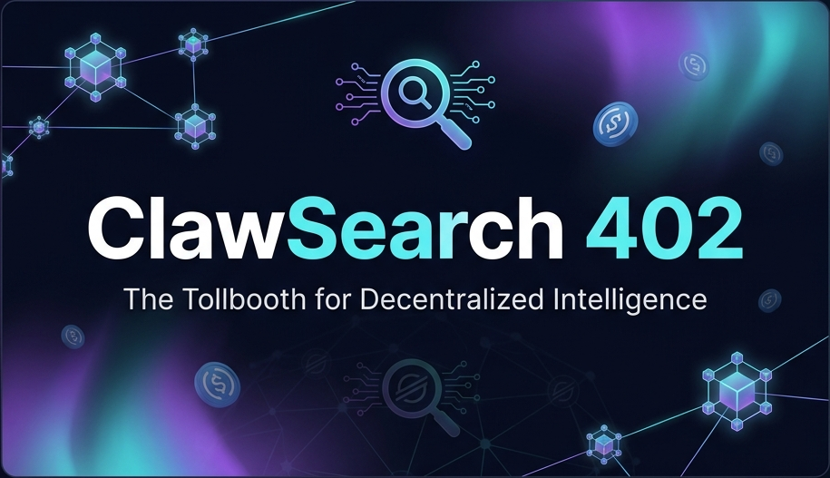
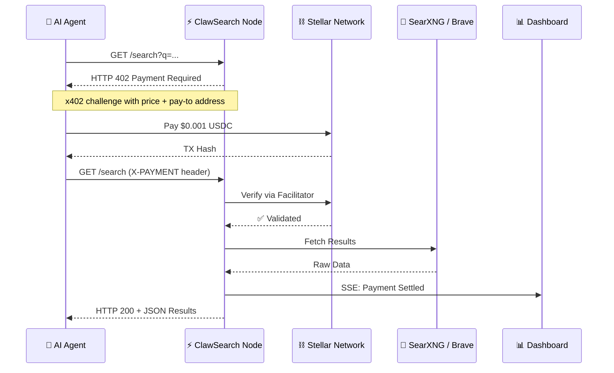
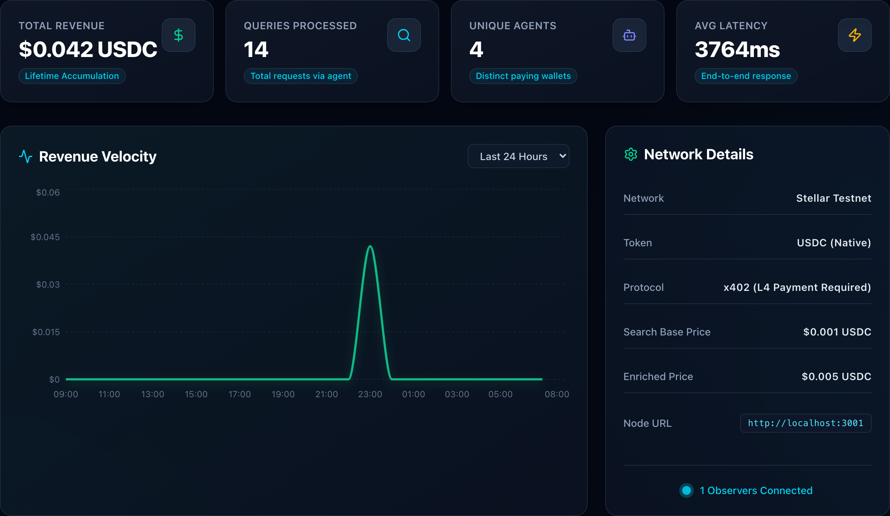
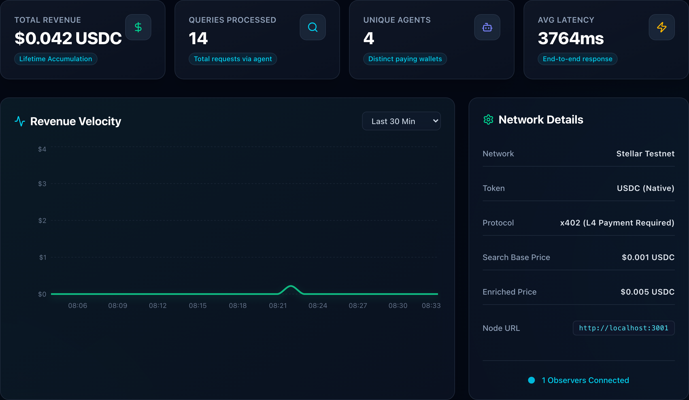
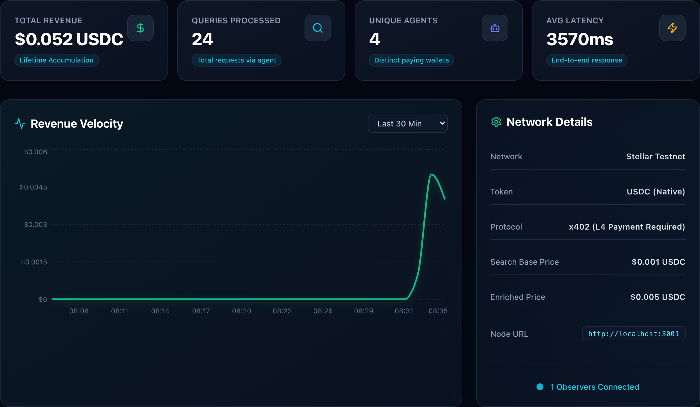
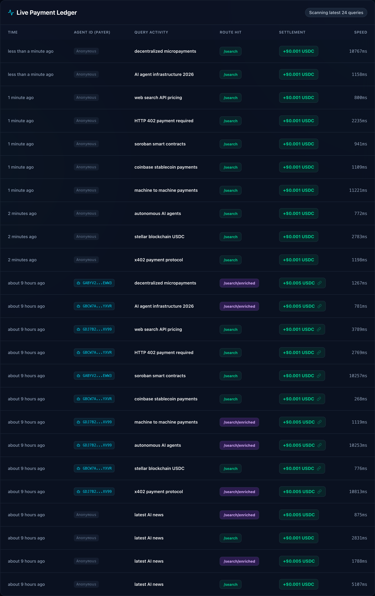
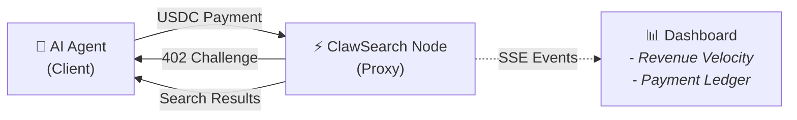

<p align="center">
  
</p>

<h1 align="center">🔍 ClawSearch 402</h1>

<p align="center">
  <strong>Agentic Web Search Monetization Network</strong><br>
  Pay-per-query search infrastructure for autonomous AI agents, powered by Stellar USDC micropayments.
</p>

<p align="center">
  <a href="https://opensource.org/licenses/MIT"></a>
  
  
  
  
  
</p>

---

## The Problem

In the emerging machine-to-machine economy, AI agents need to **reliably purchase data on the fly**. Traditional APIs weren't designed for autonomous micro-transactions — they require API keys, billing agreements, and human intervention. There's no native way for an agent to simply *pay and pull*.

## The Solution

ClawSearch 402 resurrects the forgotten **HTTP 402 "Payment Required"** status code and pairs it with **Stellar blockchain** settlements to create a frictionless pay-per-query search network.

> An AI agent sends a search request → receives a `402` challenge → pays `$0.001 USDC` on Stellar → instantly gets results. No API keys. No accounts. Just pay and pull.

---

## Architecture



### Monorepo Structure

```
clawsearch-402/
├── apps/
│   ├── proxy/          # Express x402 tollbooth (Node 22, CommonJS)
│   └── dashboard/      # Real-time analytics (Next.js 16, React 19)
├── clients/
│   └── node/           # Autonomous agent CLI client
├── scripts/            # Demo recording & automation
└── docker-compose.yml  # One-command full stack
```

| Component | Description | Tech |
|-----------|-------------|------|
| **`apps/proxy`** | The tollbooth — Express server guarded by `@x402/express` middleware. Rejects unpaid requests with `402`, verifies Stellar transactions, proxies search queries. | Express 5, x402 SDK 2.9, Stellar SDK |
| **`apps/dashboard`** | Mission control — live SSE-powered analytics showing revenue velocity, payment ledger, and network stats in real time. | Next.js 16, React 19, Recharts 3, SSE |
| **`clients/node`** | The customer — autonomous agent that navigates the full x402 handshake: receive 402 → sign Stellar payment → retry with proof → get results. | Node.js 22, @x402/client |

---

## Features

- 🔐 **x402 Protocol** — Native HTTP 402 payment challenges with Stellar USDC settlement
- ⚡ **Sub-second settlements** — Stellar finality in ~5 seconds, verified on-chain
- 📊 **Real-time dashboard** — SSE-powered live revenue velocity graph, payment ledger, and agent tracking
- 🤖 **Agent-native** — Zero API keys, zero accounts — agents just pay and pull
- 💰 **Tiered pricing** — Basic search ($0.001) and enriched/AI-optimized results ($0.005)
- 🐳 **Docker Compose** — One command to run the full stack including self-hosted SearXNG
- 🔄 **Multi-source fallback** — SearXNG primary with Brave API fallback

---

## Quick Start

### Prerequisites

- **Node.js 22+** and npm
- **Docker** (optional, for SearXNG self-hosting)

### 1. Clone & Install

```bash
git clone https://github.com/edycutjong/ClawSearch402.git
cd ClawSearch402
npm install
```

### 2. Generate & Fund Wallets

```bash
cd clients/node && npm install

# Auto-generates keypairs, funds XLM, sets up USDC trustlines
node fund.js
```

> This writes `.env` files to both `apps/proxy/` and `clients/node/` automatically.

### 3. Fund Client with Testnet USDC

The `fund.js` script handles everything except USDC (blocked by CAPTCHA):

1. Copy your **Client Wallet Address** from the terminal output (or `clients/node/.env` → `STELLAR_PUBLIC_KEY`)
2. Visit the [Circle Testnet Faucet](https://faucet.circle.com/)
3. Select **Stellar Testnet**, paste your address, complete the CAPTCHA

### 4. Start the Stack

**Option A: Docker Compose** (recommended — includes SearXNG)

```bash
npm run docker:up       # Build & start all containers
npm run docker:logs     # View real-time logs
npm run docker:down     # Stop everything
```

**Option B: Local**

```bash
npm run dev             # Starts proxy (port 3001) + dashboard (port 3000)
```

### 5. Run the Agent

```bash
# Basic search ($0.001 USDC per query)
npm run agent "latest AI news"

# Enriched search ($0.005 USDC — markdown-formatted, AI-optimized)
npm run agent "latest AI news" --enriched
```

---

## Environment Variables

### Proxy (`apps/proxy/.env`)

| Variable | Description | Source |
|----------|-------------|--------|
| `PAY_TO` | Stellar public address receiving payments | Auto-generated by `fund.js` |
| `FACILITATOR_URL` | x402 payment verification gateway | [x402.org](https://x402.org) |
| `SEARXNG_URL` | SearXNG backend URL | [searx.space](https://searx.space/) or Docker |
| `BRAVE_API_KEY` | Brave Search fallback (optional) | [brave.com/search/api](https://brave.com/search/api/) |

### Client (`clients/node/.env`)

| Variable | Description | Source |
|----------|-------------|--------|
| `STELLAR_PRIVATE_KEY` | Agent's secret key for signing payments | Auto-generated by `fund.js` |

---

## Demo

<p align="center">
  
</p>

A pre-recorded demo video showcasing the full x402 payment flow is available:

- 📹 **Video**: [Watch on YouTube](https://youtu.be/8I-lEnUFYIs) (Rendered via [Remotion](https://remotion.dev) with voiceover narration)
- 📸 **Screenshots**: Captured via Playwright automation (`scripts/graph-recorder.js`)

The demo captures the real-time monetization of AI agent search queries:

### 1. Idle State


### 2. Network Ready


### 3. Agent Swarm Burst


### 4. Post-Burst Settlement


### 5. Live Payment Ledger


---

## Tech Stack

| Layer | Technology | Version |
|-------|-----------|---------|
| Runtime | Node.js | 22+ |
| Proxy | Express | 5.1 |
| Protocol | @x402/express, @x402/stellar, @x402/core | 2.9 |
| Dashboard | Next.js | 16.2 |
| UI | React + Recharts | 19.2 / 3.8 |
| Blockchain | Stellar SDK | Testnet |
| Currency | USDC (Circle) | Native |
| Search | SearXNG / Brave API | — |
| Containerization | Docker Compose | — |

---

## How It Works



1. **Agent requests** `GET /search?q=...`
2. **Proxy responds** with `HTTP 402` including x402 payment challenge headers
3. **Agent pays** `$0.001 USDC` on Stellar, receives transaction hash
4. **Agent retries** with `X-PAYMENT` header containing the signed receipt
5. **Proxy verifies** payment on-chain via the Facilitator service
6. **Proxy fetches** search results from SearXNG/Brave
7. **Proxy streams** SSE event to dashboard with payment metadata
8. **Agent receives** `HTTP 200` with search results

---

## Contributing

See [CONTRIBUTING.md](CONTRIBUTING.md) for development guidelines.

## License

[MIT](LICENSE) — Built for the [Stellar Hacks: Agents](https://dorahacks.io/) hackathon.
