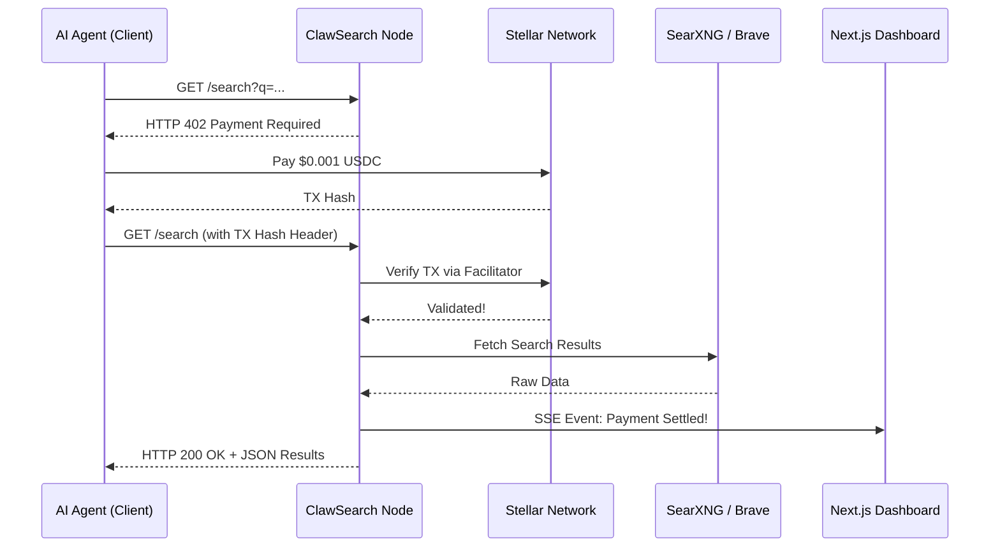

# ClawSearch 402

[](https://opensource.org/licenses/MIT)

ClawSearch 402 is an intelligent search gateway designed to be monetized on a per-request basis using the **X-402 protocol** and **Stellar USDC micropayments**. It lets AI agents or developers programmatically query the web while paying programmatically per HTTP request.

## Architecture

This project is built using a monorepo structure separating the micro-transaction gateway from the monitoring dashboard.



### Core Components

- **`apps/proxy`**: The tollbooth. An Express server that proxies requests to a search API (like SearXNG), guarded by the `@x402/express` middleware. It rejects requests lacking proper payment receipts with an HTTP `402 Payment Required` challenge, forcing the caller to settle a predefined Stellar USDC price.
- **`apps/dashboard`**: The mission control. A Next.js dashboard featuring real-time Server-Sent Events (SSE) that populates live transaction ledgers, analytics, and revenue velocity generated by connecting agents.
- **`clients/node`**: The customer. A standalone Node.js CLI script simulating an autonomous AI agent correctly navigating the X-402 protocol using the `@x402/client` library. The client receives a 402, resolves the Stellar payment challenge programmatically, and safely retrieves data.

## Features

- Search the web endpoints protected by the `x-402` payment protocol.
- Pre-configured `Stellar Testnet` wallets dynamically funded via Friendbot.
- Rich responses: Retrieve basic search lists or markdown-enriched AI-optimised datasets.
- Event-streaming capabilities via `SSE` to observe searches in real-time.

## Environment Variables

This project uses `.env` files in two locations: `apps/proxy/.env` and `clients/node/.env`. 

**Proxy (`apps/proxy/.env`)**:
- `PAY_TO`: The Stellar public address that receives payments. *Auto-generated via `node clients/node/fund.js` or [Stellar Account Creator](https://laboratory.stellar.org/#account-creator).*
- `FACILITATOR_URL`: The X402 payment verification gateway. *See docs at [x402.org](https://x402.org) or set to your custom facilitator.*
- `SEARXNG_URL`: The SearXNG backend to query. *Use public instances from [searx.space](https://searx.space/) or host your own.*
- `BRAVE_API_KEY`: (Optional fallback) *Get a free API key at [brave.com/search/api/](https://brave.com/search/api/).*

**Client (`clients/node/.env`)**:
- `STELLAR_PRIVATE_KEY`: Agent's secret key for signing payments. *Auto-generated via `node clients/node/fund.js` or [Stellar Account Creator](https://laboratory.stellar.org/#account-creator).*

## Setup Instructions

### 1. Generate & Fund Wallets

First, start by generating your cryptographic wallets and establishing the necessary Stellar Testnet configurations:

```bash
cd clients/node && npm install

# Autogenerate keys, create the testnet wallets, fund XLM, and setup USDC trustlines
node fund.js
```

> **Note**: This will automatically write to `.env` files across both the proxy and the node client configurations, preventing the need to securely manage them yourself!

### 2. Fund your Client Wallet with Testnet USDC

Because the `fund.js` script handles everything except generating the actual Testnet USDC (which is blocked by Cloudflare + CAPTCHA bots), you need to get the `USDC` manually to successfully trigger searches through the paywall.

1. Locate your **Client Wallet Address** (which is written your terminal or `clients/node/.env` as `STELLAR_PUBLIC_KEY`).
2. Visit the [Circle Testnet Faucet](https://faucet.circle.com/).
3. Choose the **Stellar Testnet** and input your public key.
4. Click 'Add Funds' and complete the CAPTCHA.

### 3. Start the Server

You have two options to run the stack: Local Node processes or Docker Compose (Recommended).

#### Option A: Docker Compose (Recommended)
Running through Docker automatically includes a self-hosted `SearXNG` instance, bypassing any third-party rate limits.

```bash
# Build and start all containers in the background
npm run docker:up

# View real-time logs
npm run docker:logs

# Stop all containers
npm run docker:down
```
> **Note on Stopping Docker**: Because Docker runs in the background (`-d`), pressing `Ctrl+C` while viewing logs *only stops the log viewer*. You **must** run `npm run docker:down` to fully kill the proxy, dashboard, and search engine!

#### Option B: Local Native
```bash
# Start all the apps concurrently from the root directory
npm install
npm run dev

# Or start the proxy independently
npm run proxy
```
> **Note on Stopping Locally**: If you started via `npm run dev`, simply pressing `Ctrl+C` in your terminal *will* successfully kill both the proxy and dashboard processes together.

Your search proxy will listen on `localhost:3001` and your dashboard on `localhost:3000`.

### 4. Perform a Search!

```bash
# In a new terminal, run the agent:
npm run agent "latest AI news"

# Try an enriched query (higher cost, more data):
npm run agent "latest AI news" --enriched
```

The node agent will query `localhost:3001/search`. Upon receipt of the 402 challenge, it will initiate a `.pay()` routine via Stellar, complete it successfully, and return an array of the latest web results.

## License
MIT
